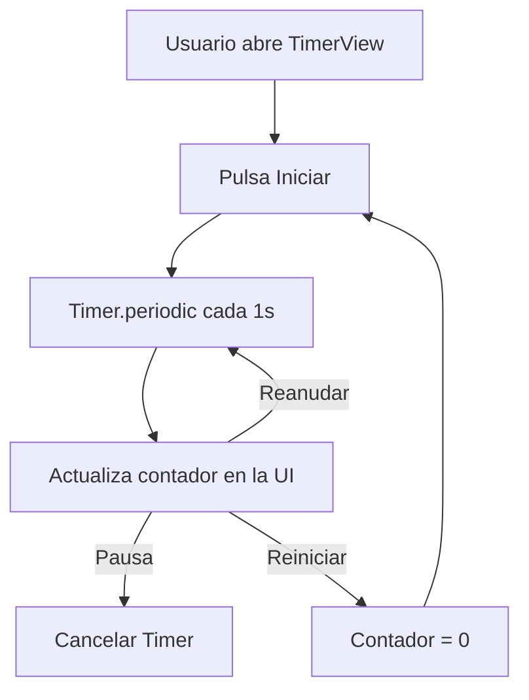
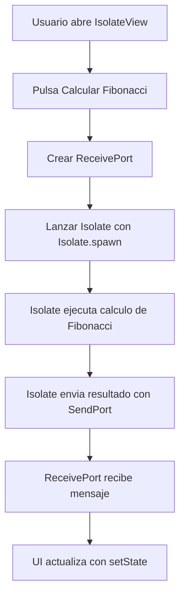
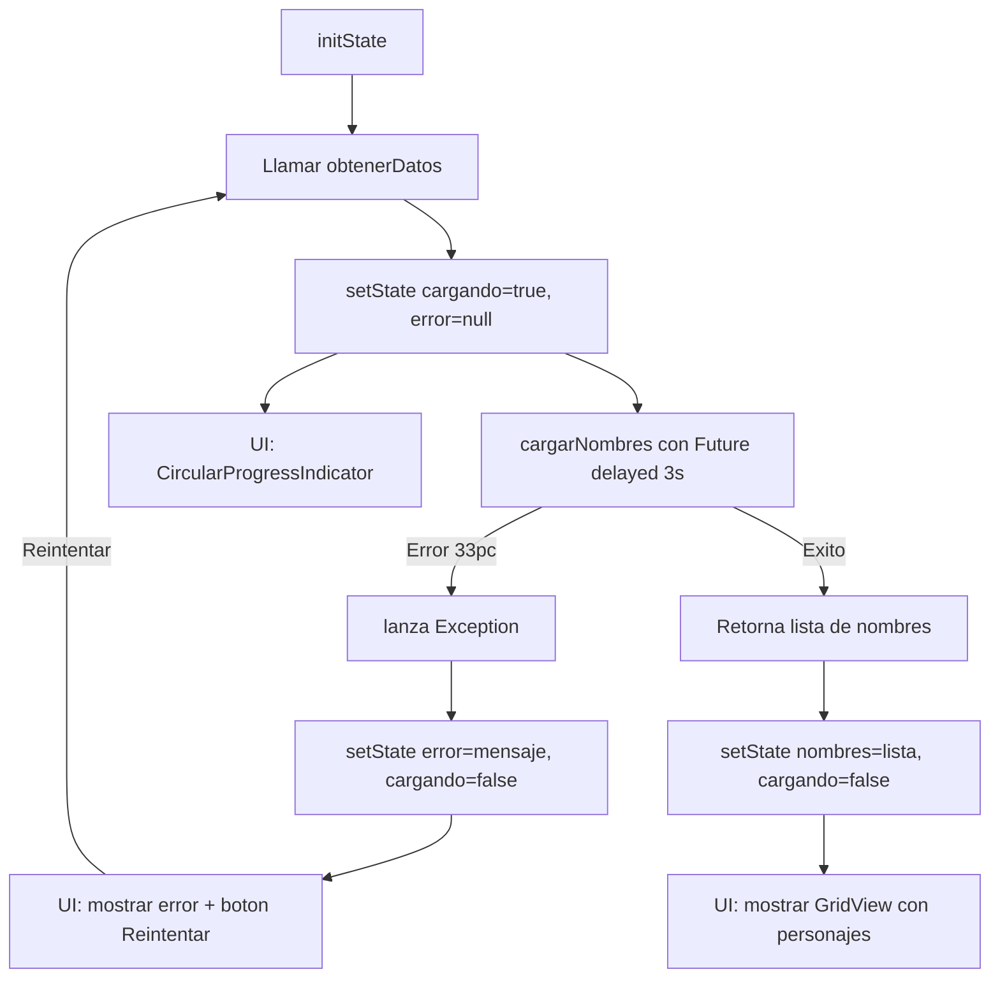

# Flutter - Manejo de asincronía, Timer e Isolates

Este proyecto demuestra el uso de las principales herramientas de Flutter para manejar procesos asíncronos y tareas pesadas sin bloquear la interfaz de usuario (UI).

---

## 1. Future / async / await

- **Cuándo usarlo**:  
  Cuando se necesita ejecutar una operación asíncrona que puede tardar, como una consulta a una API, lectura de base de datos o simulación de carga de datos.

- **Cómo funciona**:  
  - `Future` representa una operación que se completará en el futuro.  
  - `async/await` permite escribir código asíncrono de manera más legible.  
  - Mientras la operación se completa, la UI no se bloquea.  

- **Ejemplo en el proyecto**:  
  Simulación de consulta de datos con `Future.delayed`.  
  La pantalla muestra estados: **Cargando... / Éxito / Error**.

---

## 2. Timer

- **Cuándo usarlo**:  
  Cuando se necesita ejecutar algo repetidamente en intervalos de tiempo (cronómetro, cuenta regresiva) o retrasar una acción.

- **Cómo funciona**:  
  - `Timer` ejecuta una acción después de un tiempo.  
  - `Timer.periodic` ejecuta acciones repetidas cada cierto intervalo.  
  - Se debe cancelar con `.cancel()` para liberar recursos.  

- **Ejemplo en el proyecto**:  
  Un cronómetro con botones de **Iniciar, Pausar, Reanudar y Reiniciar**, actualizando la UI cada segundo.

---

## 3. Isolate

- **Cuándo usarlo**:  
  Cuando se requiere ejecutar una tarea **CPU-bound** (intensiva en procesamiento) como cálculos matemáticos complejos, generación de datos grandes o compresión.

- **Cómo funciona**:  
  - Flutter corre en un solo hilo principal que maneja la UI.  
  - Los **Isolates** permiten ejecutar tareas pesadas en un hilo separado.  
  - La comunicación entre isolates se hace por **mensajes** con `SendPort` y `ReceivePort`.  

- **Ejemplo en el proyecto**:  
  Cálculo de Fibonacci con `Isolate.spawn`.  
  El resultado se envía como mensaje de regreso al hilo principal y se muestra en la UI.

---

## 4. Pantallas y flujos implementados

### Lista de pantallas
- **HomeScreen**: pantalla inicial con navegación hacia los ejemplos.
- **FutureView**: demostración de carga de datos simulada con `Future` y `async/await`.
- **TimerView**: cronómetro con control mediante `Timer`.
- **IsolateView**: cálculo de Fibonacci en un isolate para evitar bloquear la UI.

---

## 5. Diagramas de flujos

### Flujo del Timer

---

### Flujo de Isolate

---

### Flujo Asincronía con Future / async / await

